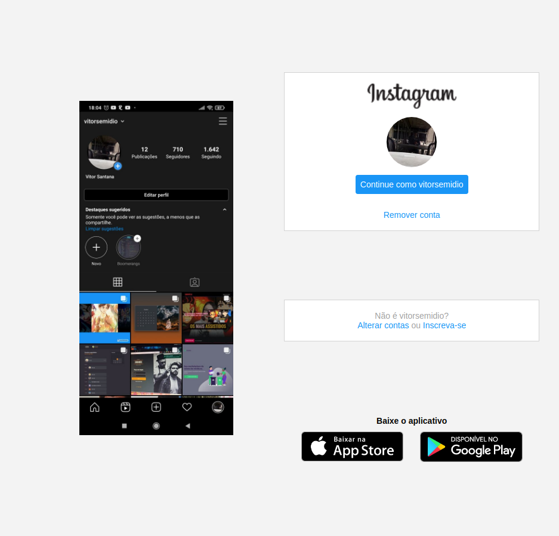
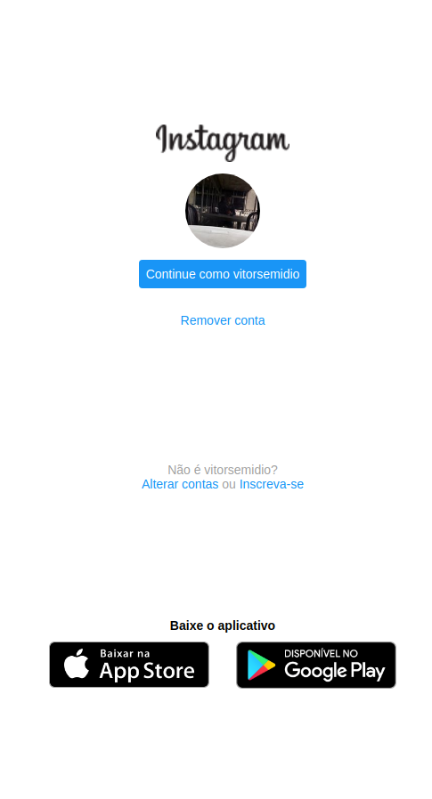

# Home Page Instagram

## 🧑‍💻 Sobre a aplicação

Durante o bootcamp **HTML Web Developer** da [Digital Innovation One](https://github.com/digitalinnovationone) houve uma aula apresentada pela [Gabriela Pinheiro](https://www.linkedin.com/in/gabrielapinheiro129/) ensinando como fazer um clone da página inicial do Instagram.

Acesse este projeto pelo Github Pages [clicando aqui](https://vitorsemidio-dev.github.io/DIO-home-Instagram/)

## 📸 Imagens

  
  

## 📬 Encontre-me

